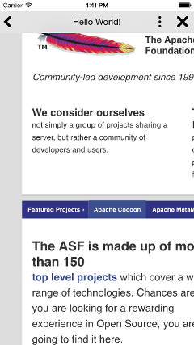
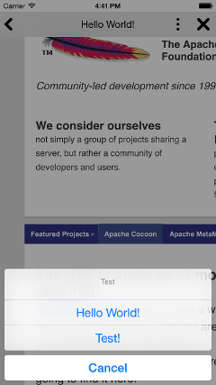
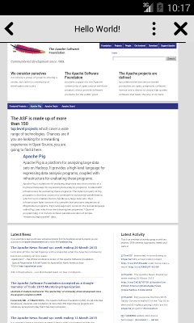
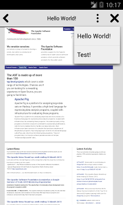

<!---
    Licensed to the Apache Software Foundation (ASF) under one
    or more contributor license agreements.  See the NOTICE file
    distributed with this work for additional information
    regarding copyright ownership.  The ASF licenses this file
    to you under the Apache License, Version 2.0 (the
    "License"); you may not use this file except in compliance
    with the License.  You may obtain a copy of the License at

      http://www.apache.org/licenses/LICENSE-2.0

    Unless required by applicable law or agreed to in writing,
    software distributed under the License is distributed on an
    "AS IS" BASIS, WITHOUT WARRANTIES OR CONDITIONS OF ANY
    KIND, either express or implied.  See the License for the
    specific language governing permissions and limitations
    under the License.
-->

com.initialxy.cordova.themeablebrowser
======================================

This plugin is a fork of [org.apache.cordova.inappbrowser](https://github.com/apache/cordova-plugin-inappbrowser). It attempts to retain most of the features of the InAppBrowser. In fact, for the full list of features inherited from InAppBrowser, please refer to [InAppBrowser's documentation](https://github.com/apache/cordova-plugin-inappbrowser/blob/master/README.md).

The purpose of this plugin is to provide an in-app-browser that can also be configured to match the theme of your app, in order to give it a more immersive look and feel for your app, as well as provide a more consistent look and feel across platforms.

This plugin launches an in-app web view on top the existing [CordovaWebView](https://github.com/apache/cordova-android/blob/master/framework/src/org/apache/cordova/CordovaWebView.java) by calling `cordova.ThemeableBrowser.open()`.

    // Keep in mind that you must add your own images to native resource.
    // Images below are for sample only. They are not imported by this plugin.
    cordova.ThemeableBrowser.open('http://apache.org', '_blank', {
        statusbar: {
            color: '#ffffffff'
        },
        toolbar: {
            height: 44,
            color: '#f0f0f0ff'
        },
        title: {
            color: '#003264ff',
            showPageTitle: true
        },
        backButton: {
            image: 'back',
            imagePressed: 'back_pressed',
            align: 'left',
            event: 'backPressed'
        },
        forwardButton: {
            image: 'forward',
            imagePressed: 'forward_pressed',
            align: 'left',
            event: 'forwardPressed'
        },
        closeButton: {
            image: 'close',
            imagePressed: 'close_pressed',
            align: 'left',
            event: 'closePressed'
        },
        customButtons: [
            {
                image: 'share',
                imagePressed: 'share_pressed',
                align: 'right',
                event: 'sharePressed'
            }
        ],
        menu: {
            image: 'menu',
            imagePressed: 'menu_pressed',
            title: 'Test',
            cancel: 'Cancel',
            align: 'right',
            items: [
                {
                    event: 'helloPressed',
                    label: 'Hello World!'
                },
                {
                    event: 'testPressed',
                    label: 'Test!'
                }
            ]
        },
        backButtonCanClose: true
    }).addEventListener('backPressed', function(e) {
        alert('back pressed');
    }).addEventListener('helloPressed', function(e) {
        alert('hello pressed');
    }).addEventListener('sharePressed', function(e) {
        alert(e.url);
    }).addEventListener(cordova.ThemeableBrowser.EVT_ERR, function(e) {
        console.error(e.message);
    }).addEventListener(cordova.ThemeableBrowser.EVT_WRN, function(e) {
        console.log(e.message);
    });

Installation
------------

    cordova plugin add com.initialxy.cordova.themeablebrowser

Additional Properties
---------------------

In addition to InAppBrowser's properties, following properties were added to fulfill this plugin's purpose in a nested JSON object.

+ `statusbar` applicable to only iOS 7+.
    + `color` sets status bar color for iOS 7+ in RGBA web hex format. eg. `#fff0f0ff`. Default to white. Applicable to only iOS 7+.
+ `toolbar`
    + `height` sets height of toolbar. Default to 44.
    + `color` sets browser toolbar color in RGBA web hex format. eg. `#fff0f0ff`. Default to white. Also see `image`.
    + `image` sets an image as browser toolbar background in titled mode. This property references to a **native** image resource, therefore it is platform dependent.
+ `title`
    + `color` sets title text color in RGBA web hex format. eg. `#fff0f0ff`. Default to black.
    + `staticText` sets static text for title. This property overrides `showPageTitle` (see below).
    + `showPageTitle` when set to true, title of the current web page will be shown.
+ `backButton`
    + `image` sets image for back button. This property references to a **native** image resource, therefore it is platform dependent.
    + `imagePressed` sets image for back button in its pressed state. This property references to a **native** image resource, therefore it is platform dependent.
    + `align` aligns back button to either `left` or `right`. Default to `left`.
    + `event` raises an custom event with given text as event name when back button is pressed. Optional.
+ `forwardButton`
    + `image` sets image for forward button. This property references to a **native** image resource, therefore it is platform dependent.
    + `imagePressed` sets image for forward button in its pressed state. This property references to a **native** image resource, therefore it is platform dependent.
    + `align` aligns forward button to either `left` or `right`. Default to `left`.
    + `event` raises an custom event with given text as event name when forward button is pressed. Optional.
+ `closeButton`
    + `image` sets image for close button. This property references to a **native** image resource, therefore it is platform dependent.
    + `imagePressed` sets image for close button in its pressed state. This property references to a **native** image resource, therefore it is platform dependent.
    + `align` aligns close button to either `left` or `right`. Default to `left`.
    + `event` raises an custom event with given text as event name when close button is pressed. Optional.
+ `menu`
    + `title` sets menu title when menu button is clicked. iOS only.
    + `cancel` sets menu cancel button text. iOS only.
    + `image` sets image for menu button. This property references to a **native** image resource, therefore it is platform dependent.
    + `imagePressed` sets image for menu button in its pressed state. This property references to a **native** image resource, therefore it is platform dependent.
    + `event` raises an custom event with given text as event name when menu button is pressed. Optional.
    + `align` aligns menu button to either `left` or `right`. Default to `left`.
    + `items` is a list of items to be shown when menu is open
        + `event` defines the event name that will be raised when this menu item is clicked. The callbacks to menu events will receive an event object that contains the following properties: `url` is the current URL shown in browser and `index` is the index of the selected item in `items`.
        + `label` defines the menu item label text.
+ `customButtons` is a list of objects that will be inserted into toolbar when given.
    + `image` sets image for custom button. This property references to a **native** image resource, therefore it is platform dependent.
    + `imagePressed` sets image for custom button in its pressed state. This property references to a **native** image resource, therefore it is platform dependent.
    + `align` aligns custom button to either `left` or `right`. Default to `left`.
    + `event` raises an custom event with given text as event name when custom button is pressed. The callbacks to custom button events will receive an event object that contains the following properties: `url` is the current URL shown in browser and `index` is the index of the selected button in `customButtons`.
+ `backButtonCanClose` allows back button to close browser when there's no more to go back. Otherwise, back button will be disabled.
+ `disableAnimation` when set to true, disables browser show and close animations.

All properties are optional with little default values. If a property is not given, its corresponding UI element will not be shown.

One thing to note is that all image resources reference to **native** resource bundle. So all images need to be imported to native project first. In case of Android, the image name will be looked up under `R.drawable`. eg. If image name is `hello_world`, `R.drawable.hello_world` will be referenced.

You may have noticed that ThemedBrowser added an optional menu as well as custom buttons, which you can utilize to respond to some simple user actions.

Additional Methods
------------------

The reference object returned by `cordova.ThemeableBrowser.open` contains the following methods in addition to InAppBrowser's implementation:

+ `reload` reloads the current page.

Import Native Images
--------------------

If you are a native developer and are already aware how to import native image resources, feel free to skip this section. Otherwise, here are some tips. First of all, your native iOS and Android projects are located at:

    <cordova_project_root>/platforms/ios
    <cordova_project_root>/platforms/android

Let's start with Android, which is quite straightforward. Prepare your images for all of the pixel densities that you'd like to support. [Here is a documentation](http://developer.android.com/guide/practices/screens_support.html) that explains this concept. The gist is that on higher pixel density screens, your images will have to have higher resolution in order to look sharp on an actual device, so you want to prepare multiple files for the same image at different resolutions for their respective pixel density. In Android, there are a lot of densities due to diversity of devices, so you have to decide which ones you want to support. Fortunately if you don't have an image for a particular pixel density, Android will automatically pick up the closest one and try to down scale or up scale it. Of course this process is not very efficient, so you have to make your decisions. The directory where you want to place your images are under

    <cordova_project_root>/platforms/android/res

Notice how there are multiple folders named `drawble-.*`. Each file for the same image should be named the same, but it will need to be moved under the correct directory with respect to its target density. eg. If `icon.png` is intended for xhdpi, then it needs to go under `drawable-xhdpi` directory. In your JavaScript config, you can then reference to this iamge without extension. eg. With the previous example, simply `icon` will suffice.

To import image resources for iOS, it is slightly trickier, because you **have** to register your file in Xcode project file with help from Xcode, and there are two ways of doing this. Let's start with the old school way. iOS also shares similar concept with Android in terms of pixel density. iPhone to iPhone 3GS uses 1x the resolution, iPhone 4 to iPhone 6 uses 2x the resolution while iPhone 6 Plus and above uses 3x the resolution (even though it's actually down scaled, but that's a different discussion). In the old school way, you have to name your images with `@1x`, `@2x`, and `@3x` suffix with respect to their target density. eg. `icon@2x.png`. [Here is a documentation](https://developer.apple.com/library/ios/documentation/2DDrawing/Conceptual/DrawingPrintingiOS/SupportingHiResScreensInViews/SupportingHiResScreensInViews.html) that explains this concept. You then have to move it under

    <cordova_project_root>/platforms/ios/<project_name>/Resources

Then open your native iOS project with Xcode by double clicking on

    <cordova_project_root>/platforms/ios/<project_name>.xcodeproj

In the left hand side panel, make sure you are in Project navigator tab. Then you can see a list of directories under your project. One of them being `Resources`, but you don't see your newly added images there. Now you need to drag your images fron Finder to Xcode and drop it under `Resource` folder. In your JavaScript config, you can then reference to them without suffix or extension. eg. With the previous example, simply `icon` will suffice.

The new school way is to use [Asset Catalog](https://developer.apple.com/library/ios/recipes/xcode_help-image_catalog-1.0/Recipe.html). This is the recommended technique from Xcode 5+ and iOS 7+. It gives you better management of all of your image resources. ie. No more suffix, and you can see all your images for different densities in one table etc. However there are more steps involved to set it up. Please reference to [this guide](http://www.intertech.com/Blog/xcode-assets-xcassets/) for a step by step walkthrough.

Errors and Warnings
-------------------

This plugin does not want to be the source of your app crash, not to mention that you have no way to catch exceptions from native code, so it does not throw exceptions. Neither does it want to write to log, because it wants to avoid polluting your log and respect your choice of logging library. Hence all errors are warnings are reported back to you through events. You may listen to two special events defined by `cordova.ThemeableBrowser.EVT_ERR` and `cordova.ThemeableBrowser.EVT_WRN`. Upon error or warning, you will receive event object that contains the following properties:

+ `code` contains the error or warning code, which is defined by one of the followings:
    + `cordova.ThemeableBrowser.ERR_CRITICAL` is raised for a critical error that you should definitely try to resolve. eg. JSON parser failure. Dialer launch failure. Raised only for `cordova.ThemeableBrowser.EVT_ERR` event.
    + `cordova.ThemeableBrowser.ERR_LOADFAIL` is raised when a native image that you referenced in your config failed to load from native resource bundle. Raised only for `cordova.ThemeableBrowser.EVT_ERR` event.
    + `cordova.ThemeableBrowser.WRN_UNDEFINED` is raised when a property in your config is not defined. You will not get this warning for every property that is undefined, just the ones that might cause confusion. Raised only for `cordova.ThemeableBrowser.EVT_WRN` event.
    + `cordova.ThemeableBrowser.WRN_UNEXPECTED` is raised when an unexpected behaviour is committed. You can ignore this warning, since such behaviours will be simply ignored. eg. Try to close the browser when it's already closed. Raised only for `cordova.ThemeableBrowser.EVT_WRN` event.
+ `message` contains a readable message that will try its best to tell you want went wrong.

Examples:

    cordova.ThemeableBrowser.open('http://apache.org', '_blank', {
        ...
    }).addEventListener(cordova.ThemeableBrowser.EVT_ERR, function(e) {
        if (e.code === cordova.ThemeableBrowser.ERR_CRITICAL) {
            // TODO: Handle critical error.
        } else if (e.code === cordova.ThemeableBrowser.ERR_LOADFAIL) {
            // TODO: Image failed to load.
        }

        console.error(e.message);
    }).addEventListener(cordova.ThemeableBrowser.EVT_WRN, function(e) {
        if (e.code === cordova.ThemeableBrowser.WRN_UNDEFINED) {
            // TODO: Some property undefined in config.
        } else if (e.code === cordova.ThemeableBrowser.WRN_UNEXPECTED) {
            // TODO: Something strange happened. But no big deal.
        }

        console.log(e.message);
    });

These events are intended to help you debug strange behaviours. So if you run into something weird, please listene to these events and it might just tell you what's wrong. Please note errors and warnings are not completely consistent across platforms. There are some minor platform differences.

FAQ
---

### I just installed this plugin, how come it just shows a blank toolbar?

The purpose of this plugin is to allow **you** to style the in app browser the way you want. Isn't that why you installed this plugin in the first place? Hence, it does not come with any defaults. Every UI element needs to be styled by you, otherwise it's hidden. This also avoids polluting your resouce bundle with default images.

### Why does my menu on Android look ugly?

Android menu is simply a [Spinner](http://developer.android.com/guide/topics/ui/controls/spinner.html), which picks up its style from your Activity's theme. By default Cordova uses the very old [Theme.Black.NoTitleBar](http://developer.android.com/reference/android/R.style.html#Theme_Black_NoTitleBar), which is ugly. Open your AndroidManifest.xml and change your `android:theme` attribute to something more morden, such as [Theme.Holo](http://developer.android.com/reference/android/R.style.html#Theme_Holo) or [Base.Theme.AppCompat](http://developer.android.com/reference/android/support/v7/appcompat/R.style.html#Base_Theme_AppCompat) from [support library](https://developer.android.com/tools/support-library/features.html#v7-appcompat).

### How do I style Android menu?

Android menu is simply a [Spinner](http://developer.android.com/guide/topics/ui/controls/spinner.html) with default layout resources, which picks up its style from your Activity's theme. You can style it by making a theme of your app and apply it to your activity. See `android:dropDownListViewStyle`.

### How do I add margings and paddings?

There is no margins or paddings. However notice that you can assign images to each of the buttons. So take advantage of PNG's transparency to create margins/paddings around your buttons.

### How do I add shadow to the toolbar?

First, notice that you can use an image as well as color for toolbar background. Use PNG for background image and create shadow inside this image. Next, you will probably be concerned about how buttons will slightly misaligned due since they always middle align. Again create some transparent borders in your button images to offset the misalignment. eg. Say your shadow is 5px tall, which causes buttons to allear lower than they shoud. Create a 10px transparent bottom border for each of your button icons and you are set.

Supported Platforms
-------------------

+ iOS 5.0+
+ Android 2.0+

Currently there is no plan to support other platforms, though source code from InAppBrowser is kept for merge purposes, they are inactive, since they are removed from `plugin.xml`.

Migration
---------

This plugin is **not** a drop-in replacement for InAppBrowser. The biggest change that was made from InAppBrowser, which caused it to be no longer compatible with InAppBrowser's API is that `options` parameter now accepts a JavaScript object instead of string.

    cordova.ThemeableBrowser.open('http://apache.org', '_blank', {
        customButtons: [
            {
                image: 'share',
                imagePressed: 'share_pressed',
                align: 'right',
                event: 'sharePressed'
            }
        ],
        menu: {
            image: 'menu',
            imagePressed: 'menu_pressed',
            items: [
                {
                    event: 'helloPressed',
                    label: 'Hello World!'
                },
                {
                    event: 'testPressed',
                    label: 'Test!'
                }
            ]
        }
    });

As you can see from above, this allows configurations to have more robust and readable definition.

Furthermore, the object returned by `open` always returns its own instance allowing chaining of methods. Obviously, this breaks the immitation of `window.open()`, however it's an optional feature that you can choose not to use if you want to stay loyal to the original.

    cordova.ThemeableBrowser.open('http://apache.org', '_blank', {
        customButtons: [
            {
                image: 'share',
                imagePressed: 'share_pressed',
                align: 'right',
                event: 'sharePressed'
            }
        ],
        menu: {
            image: 'menu',
            imagePressed: 'menu_pressed',
            items: [
                {
                    event: 'helloPressed',
                    label: 'Hello World!'
                },
                {
                    event: 'testPressed',
                    label: 'Test!'
                }
            ]
        }
    }).addEventListener('sharePressed', function(event) {
        alert(event.url);
    }).addEventListener('helloPressed', function(event) {
        alert(event.url);
    }).addEventListener('testPressed', function(event) {
        alert(event.url);
    });

Two properties from InAppBrowser are disabled.
+ `location` is always `false` because address bar is not needed for an immersive experience of an integrated browser.
+ `toolbarposition` is always `top` to remain consistent across platforms.

One is redefined.
+ `toolbar` is redefined to contain toolbar settings and toolbar is always shown, because the whole point why you are using this plugin is to style toolbar right?

License
-------

This project is licensed under Aapache License 2.0. See [LICENSE](LICENSE) file.
