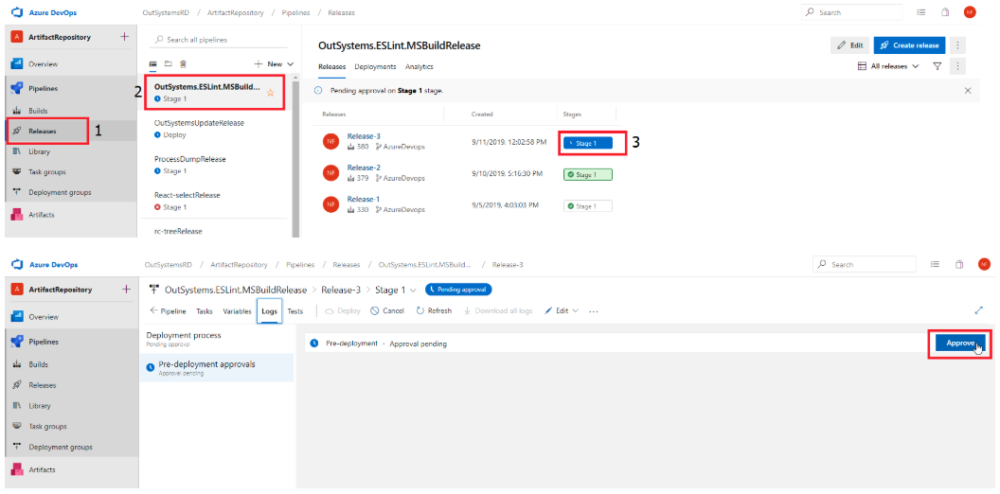

# OutSystems Appium Tests Framework

References:
https://github.com/webdriverio/appium-boilerplate

https://github.com/igniteram/appium-webdriverio-typescript

https://medium.com/the-web-tub/testing-cordova-apps-with-appium-2b3b236e026b

# Importing and Releasing Appium Framework

## How to add the access token from Azure Artifacts

Since we are using a private repository, a Personal Access Token was generated for the Mobile Team in order to have permission to access the private NPM repository and therefore, install the required dependencies.

### Installing the Acess Token
1. Access the last pass of Mobile Team and search for "**Mobile Team NPM Registry (Azure DevOps)**"
2. Copy the key to your clipboard
3. Open a new terminal session and execute the following command: `npm config edit`
4. Append the key copied to the clipboard
5. Save the file
6. Check if modifications were saved by executing the following command: `npm config list`

If you need to change some setting regarding the token, please access [**Azure Personal Access Tokens page.**](https://dev.azure.com/OutSystemsRD/_usersSettings/tokens)

## Importing outsystems-appium-test-framework to a project

To include this framework in a project, you need to specify the dependency in the **package.json** file of the project.

```
"dependencies": {
    "outsystems-appium-nodejs-tests": "~1.0.0"
}
```

After this step, just execute the command ```npm install``` and the framework will be added under the ```node_modules``` folder.

If you already have the framework installed and just want to fetch the latest version, execute the command ```npm update```.

## How to approve a new release

To release the new version, **go to Releases Pages -> click on the Release Pipeline and then locate the stage that is waiting for approval.** Please note that in order to approve a new release, it is required that the last execution of the build pipeline (OutSystemsAppiumTestsBuild) was ended with success. 

Remember that if the same version that is being released already exists in the repository, the pipeline will fail.

To release, click **Approve**.



For more info, please check the following document: [**Push packages to Azure Artifacts**](https://outsystemsrd.atlassian.net/wiki/spaces/RKB/pages/576618520/Push+packages+to+Azure+Artifacts)

# Running Appium Test Project

## Setup
1. Have Appium installed
2. Have a Node version installed below v12.0.0 (not including)
3. Run npm install to get the required dependencies

## Run Tests locally

To run the tests:
1. Start Appium server:
    * Either by using the command line or launching the server with the appium desktop application
    * Have a device connected or emulator available
2. Run the command `npm run android`

After the tests run, you can then generate a report with allure: `npm run report`

The generated report will be located in the **_allure-report_** folder

## AWS Device Farm

To run the tests in the device farm follow the steps: 
1. Create a new run in AWS
2. Upload your application (either _.ipa_ or _.apk_). Hit Next
3. Upload the test bundle:
    * Run the command `npm run bundleAws` and upload the generated `awsTests.zip` file
    * Hit Next
4. Use the contents of the [/awsAndroid.yml](awsConfiguration.yml) file for the script configuration
